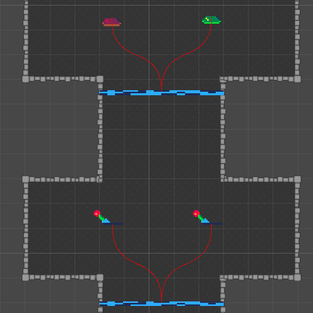
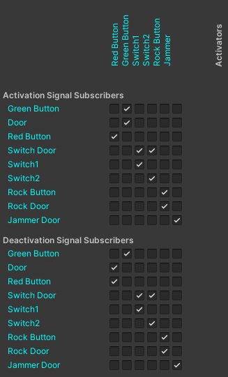
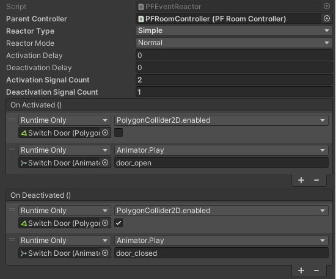
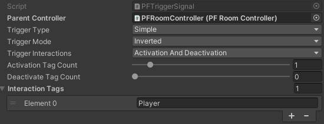

# Puzzle Forge

Puzzle Forge is a versatile Unity tool designed to streamline the process of setting up and managing interactive elements within game environments. Whether you're rigging up simple room triggers or crafting complex interaction sequences, Puzzle Forge offers an intuitive and powerful framework to bring your game's interactive components to life.

## Features

Puzzle Forge is packed with features to cater to a wide range of interaction rigging needs:

- **Easy Connection Visualization**: Quickly connect triggers to actions and visually understand how your game elements interact with each other through an intuitive editor interface.

- **Diverse Interaction Types**: Support for various interaction types to suit your game's specific needs, including:
  - **Simple**: Activate or trigger an action directly.
  - **Latching**: Maintain an action's state until explicitly changed.
  - **Toggle**: Switch between states with each activation.

- **Animation Helper Functions**: Seamlessly integrate animations with your interactions, supported for both Unity's native animation system and Spine animations. These helper functions allow for easy animation triggers including:
  - Easily rig up Activation and deactivation animation with no code. 
  - Parameter-based animation control for Unity Animator, accommodating `bool`, `float`, `int`, and `trigger` parameters.

- **Customizable Interaction Logic**: Define custom logic for how and when interactions are triggered, allowing for complex gameplay mechanics and puzzles.

- **Editor Tools**: Leverage the custom editor tools to rig up interactions without writing a single line of code, enhancing productivity and enabling rapid prototyping.

- **Multi-Object and Multi-State Support**: Easily manage interactions involving multiple objects or requiring multiple states, making it simple to create intricate interaction systems.

## Getting Started

To get started with Puzzle Forge, follow these steps:

1. **Installation**: Import Puzzle Forge into your Unity project by downloading the package and dragging it into your project's Assets folder.

2. **Setup**: Add the Puzzle Forge component to any game object you wish to be interactive. This can be done by selecting the game object in your scene, then clicking `Add Component` in the Inspector and searching for `Puzzle Forge`.

3. **Configuration**: Use the Puzzle Forge Inspector panel to connect triggers with their respective actions or animations. Define the interaction type and customize it to fit your game's mechanics.

4. **Testing**: Enter Play mode in Unity to test the interactions you've set up. Adjust configurations as needed to achieve the desired behavior.

## Coming Soon

 - **Event Driven Architecture**: Will be changing the architecture to EDA to help support larger amounts of interactions

---

Puzzle Forge is continuously being improved and updated. Stay tuned for more features and enhancements to make your game development process even smoother!

