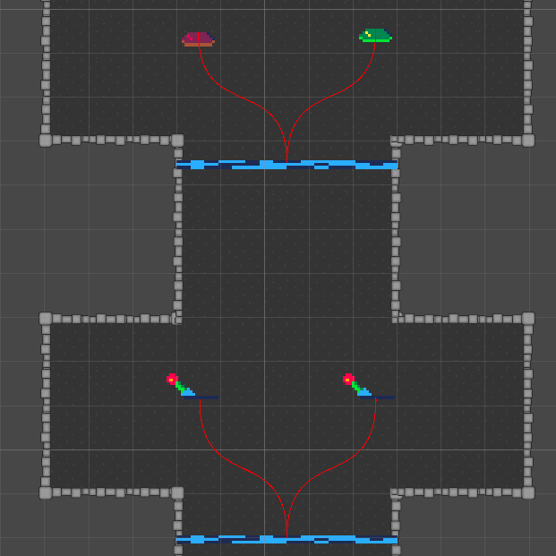
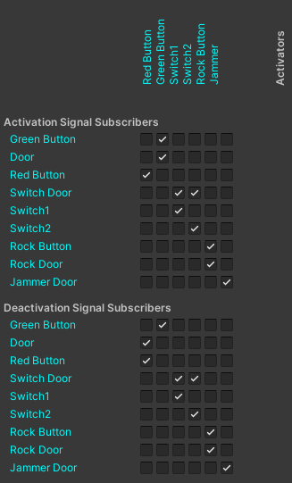
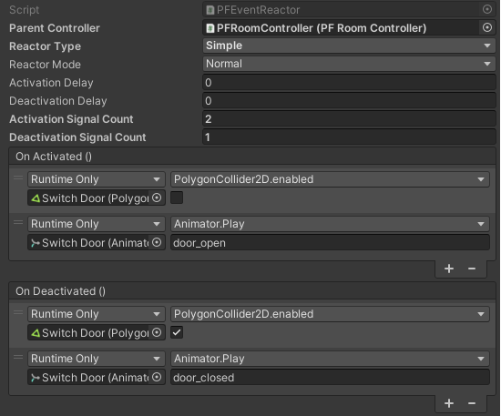
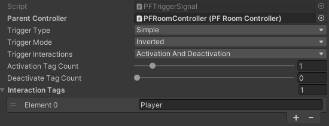

# Puzzle Forge

> A versatile Unity tool for visually rigging game interactions, triggers, and puzzles without writing code.

---

## Overview

Puzzle Forge is a no-code interaction framework for Unity that streamlines the process of setting up and managing interactive elements—from simple room triggers to complex interaction sequences with custom logic.

## Features

Puzzle Forge is packed with features to cater to a wide range of interaction rigging needs:

- **Easy Connection Visualization**: Quickly connect triggers to actions and visually understand how your game elements interact with each other through an intuitive editor interface.

- **Diverse Interaction Types**: Support for various interaction types to suit your game's specific needs, including:
  - **Simple**: Activate or trigger an action directly.
  - **Latching**: Maintain an action's state until explicitly changed.
  - **Toggle**: Switch between states with each activation.

- **Animation Helper Functions**: Seamlessly integrate animations with your interactions, supported for both Unity's native animation system and Spine animations. These helper functions allow for easy animation triggers including:
  - Easily rig up Activation and deactivation animation with no code. 
  - Parameter-based animation control for Unity Animator, accommodating `bool`, `float`, `int`, and `trigger` parameters.

- **Customizable Interaction Logic**: Define custom logic for how and when interactions are triggered, allowing for complex gameplay mechanics and puzzles.

- **Editor Tools**: Leverage the custom editor tools to rig up interactions without writing a single line of code, enhancing productivity and enabling rapid prototyping.

- **Multi-Object and Multi-State Support**: Easily manage interactions involving multiple objects or requiring multiple states, making it simple to create intricate interaction systems.

## Getting Started

To get started with Puzzle Forge, follow these steps:

1. **Installation**: Import Puzzle Forge into your Unity project by downloading the package and dragging it into your project's Assets folder.

2. **Setup**: Add the Puzzle Forge component to any game object you wish to be interactive. This can be done by selecting the game object in your scene, then clicking `Add Component` in the Inspector and searching for `Puzzle Forge`.

3. **Configuration**: Use the Puzzle Forge Inspector panel to connect triggers with their respective actions or animations. Define the interaction type and customize it to fit your game's mechanics.

4. **Testing**: Enter Play mode in Unity to test the interactions you've set up. Adjust configurations as needed to achieve the desired behavior.

## Architecture

### Core Components

**Reactor**
- Receives signals and triggers actions
- Manages state transitions
- Executes conditions and logic

**Signal**
- Carries data from trigger to reactor
- Can pass parameters (int, bool, float)
- Extensible for custom data types

**Trigger**
- Detects events (collision, input, etc.)
- Sends signals when conditions met
- Configurable sensitivity and filters

### Data Flow

```
Trigger (detects event)
    ↓
Signal (carries data)
    ↓
Reactor (executes action)
    ↓
Result (animation, state change, etc.)
```

---

## Use Cases

### Room-Based Puzzles
- Door opens when all switches activated
- Enemies spawn when player enters area
- Environmental changes on objective completion

### Complex Interactions
- Multi-step puzzle sequences
- Conditional triggers (must collect item before opening door)
- State-dependent behaviors

### Animation Integration
- Trigger animations on events
- Control parameters without code
- Sequence multiple animations

### UI Interactions
- Button presses trigger animations
- State changes update display
- Conditional UI element visibility

---

## Workflow Example

### Creating a Simple Door Puzzle

1. **Add Door GameObject**
   - Attach PuzzleForge Reactor component
   - Set animation target

2. **Add Switch Trigger**
   - Add PuzzleForge Trigger component
   - Configure as "Button Press" type

3. **Connect Components**
   - Drag Reactor into Trigger's target field
   - Set Signal type to "Boolean"
   - Configure action as "Play Animation"

4. **Set Animation**
   - Assign door open animation
   - Configure parameters (duration, loop, etc.)

5. **Test**
   - Enter Play mode
   - Activate trigger
   - Door animation plays automatically

---

## Advanced Features

### Condition Scripting
```
IF switchA AND switchB THEN activateDoor
IF collectibles >= 5 THEN unlockTreasure
IF playerHealth < 25 THEN triggerWarning
```

### Animation Control

**Unity Animator Integration**
- Set boolean parameters
- Trigger animation states
- Control float values (speed, blend)
- Call animation events

**Spine Animation Support**
- Trigger Spine animations
- Control animation parameters
- Chain animation sequences

### Multi-State Management

Handle complex scenarios:
- Multiple conditions
- State machines with transitions
- Conditional branching
- Fallback behaviors

---

## Best Practices

### Design Tips
- Keep interactions modular
- Test each connection individually
- Use descriptive naming for clarity
- Document complex logic

### Performance
- Avoid circular references
- Minimize active triggers
- Use pooling for frequent signals
- Profile in larger projects

### Debugging
- Use visual debugging mode
- Color-code connections by type
- Log signal events
- Monitor performance metrics

---

## Coming Soon

- **Event Driven Architecture** — Changing to EDA for larger interaction volumes
- **Visual Debugging** — Real-time signal flow visualization
- **Animation Timeline** — Integrated timeline editor
- **Network Support** — Multiplayer trigger synchronization
- **Plugin System** — Create custom reactors and triggers

---

## Project Structure

```
Assets/Plugins/PuzzleForge/
├── Scripts/
│   ├── Core/
│   │   ├── Reactor.cs          — Core reaction system
│   │   ├── Signal.cs           — Signal data structure
│   │   └── Trigger.cs          — Trigger base class
│   ├── Triggers/
│   │   ├── CollisionTrigger.cs
│   │   ├── InputTrigger.cs
│   │   └── TimerTrigger.cs
│   ├── Actions/
│   │   ├── AnimationAction.cs
│   │   ├── GameObjectAction.cs
│   │   └── CustomAction.cs
│   ├── Editor/
│   │   └── PuzzleForgeEditor.cs
│   └── Util/
│       └── SignalTypes.cs
└── Resources/
    └── Sprites/Icons/
```

---

## Examples

Included example scenes demonstrate:
- Basic trigger and action setup
- Animation sequencing
- Multi-object interactions
- State management
- Conditional logic

---

## Troubleshooting

### Connection Not Working
- Verify Reactor and Trigger are assigned
- Check Signal type compatibility
- Confirm animation target is set

### Animation Not Playing
- Ensure animation exists in Animator
- Check animation parameter names match
- Verify animation is not already playing

### Performance Issues
- Reduce active triggers
- Profile trigger frequency
- Optimize animation count

---

## Support & Resources

- **Documentation** — Full API reference in project
- **Example Scenes** — Learn by example
- **Forum** — Community support and discussion
- **GitHub Issues** — Report bugs and request features

---

Puzzle Forge is continuously being improved and updated. Stay tuned for more features and enhancements!

---

## Screenshots






---

## License

Copyright © Walter Gordy
